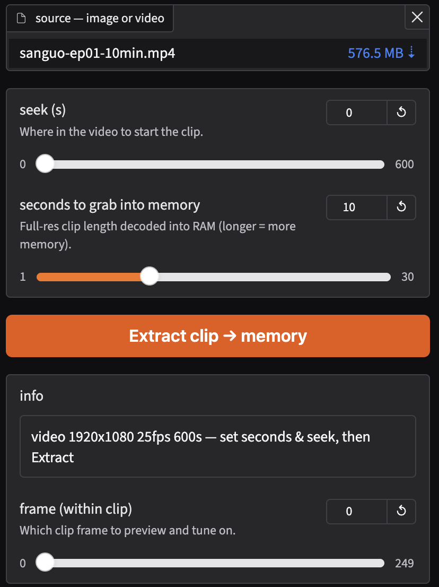
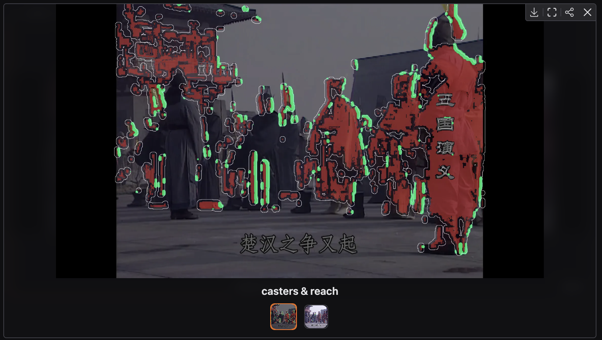
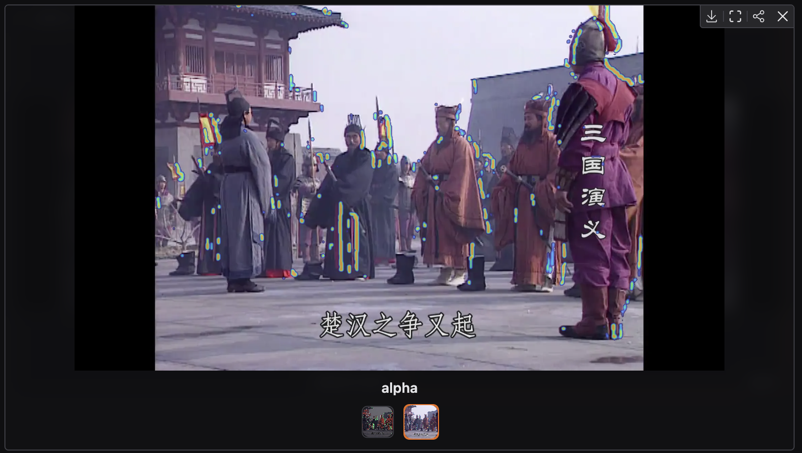
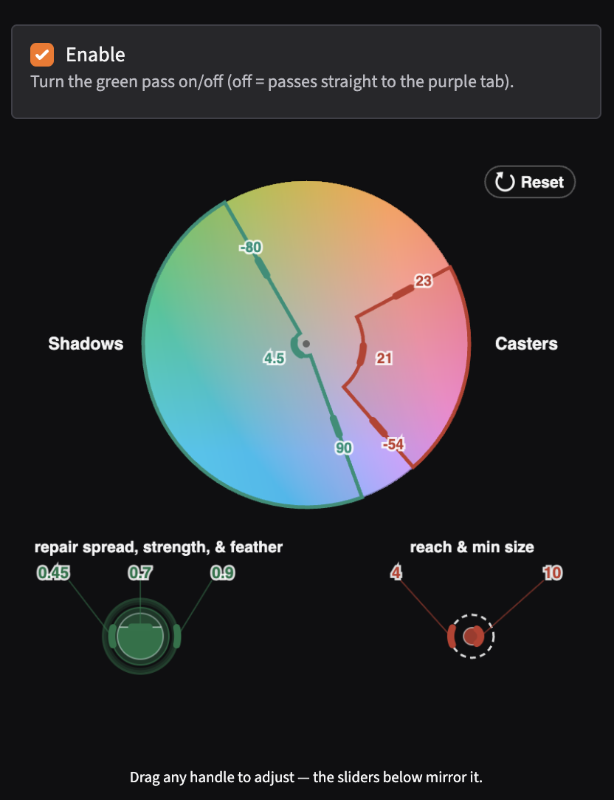
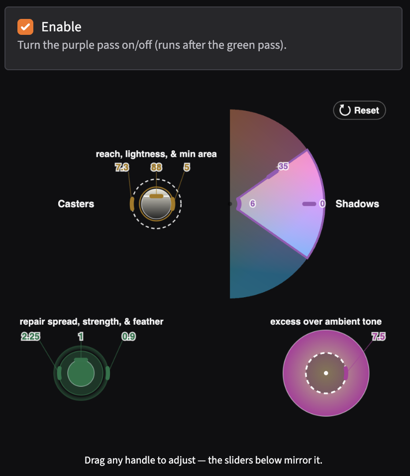
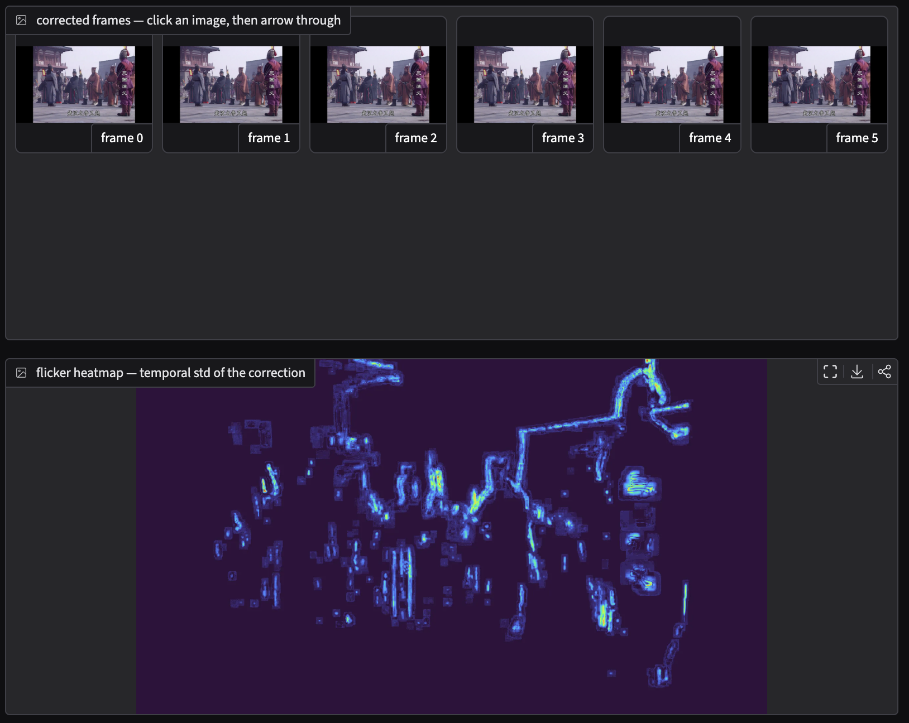
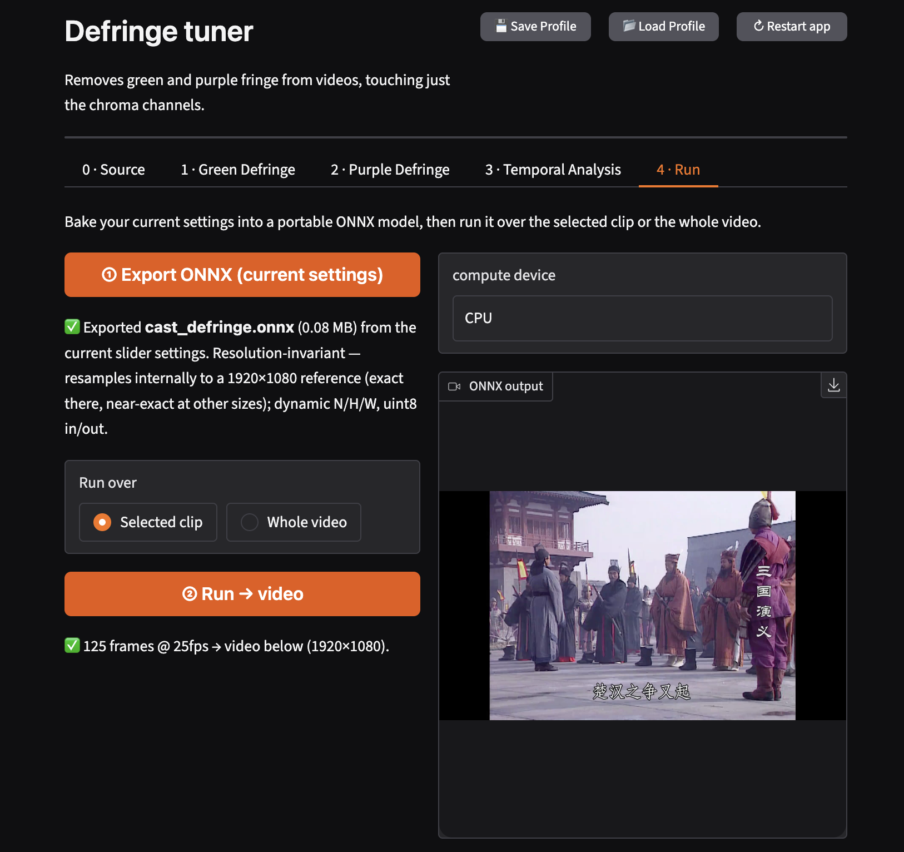

# Defringe

Removes green and purple fringe from videos, touching just the chroma channels.

## Algorithms

Fringe is a **shadow cast by a source**. First, find all the sources ("casters"). Then, find all the nearby fringe ("shadows"). Then, pull that chroma towards the clean, local tone.

**Green Fringe** is cast by saturated **warm** sources (red / purple).
**Purple Fringe** is cast by bright **blown highlight** sources.

Green fringe can be cast by purple fringe. If you remove purple fringe first, the green fringe it casts will be orphaned (without a caster), and will be unable to be removed by the green fringe algorithm. So, run green first, then purple.

`defringe_numpy.py` is the canonical numpy implementation; `defringe_torch.py` is its ONNX-exportable twin (convolutions in place of scipy's `label`/EDT). They share `geometry.py` (the resolution-relative → pixel conversion and reach/area calibration) so the two can't drift; `tests/` pins the twin to the reference.

## Walkthrough

Five tabs: load a clip, tune each pass on a colour wheel, check it holds over time, export ONNX.

**0 · Source** — point at a video, extract a few seconds into memory.

<p align="center"></p>

**Overlays** — see what each pass touches: the casters and their reach, and the correction alpha.

<table>
<tr>
<td align="center"></td>
<td align="center"></td>
</tr>
<tr>
<td align="center"><sub>casters &amp; reach</sub></td>
<td align="center"><sub>alpha</sub></td>
</tr>
</table>

**1–2 · Green & Purple** — drag the *Casters* and *Shadows* wedges; the sliders below mirror the handles.

<table>
<tr>
<td align="center"></td>
<td align="center"></td>
</tr>
<tr>
<td align="center"><sub>green pass</sub></td>
<td align="center"><sub>purple pass</sub></td>
</tr>
</table>

**3 · Temporal** — scrub corrected frames; the flicker heatmap flags shimmer.

<p align="center"></p>

**4 · Run** — bake settings into a portable ONNX model, run it over the clip or the whole video.

<p align="center"></p>

## Layout

```
app.py                Gradio tuner — layout + event wiring (controllers); the launcher
defringe/             the library package
  defringe_numpy.py   the domain logic (source of truth): green & purple casts,
                      the shared cast engine, Lab/soft-step helpers — pure numpy/skimage
  defringe_torch.py   torch/ONNX twin — tracks the numpy reference
  geometry.py         resolution-relative → pixel conversion + reach/area calibration,
                      shared by both twins so they can't drift
  parameters.py       the tunable-parameter spec: one Param row per knob (name, default,
                      range, label, help) — the single source the rest projects from
  sliders.py          builds a Gradio slider per spec; the registry, persistence, profiles
  views.py            detection overlays + colour-wheel config (presentation)
  video_io.py         ffmpeg wrappers: decode clips/frames, stream-decode, encode
  onnx_runtime.py     ONNX Runtime device selection + session building
assets/               frontend: defringe_wheel.js, gradio_ui.js, acc.css
model/                cast_defringe.onnx — exported model (uint8 RGB in/out, dynamic N/H/W)
colab_defringe.ipynb  GPU runner: ONNX over a whole video, colour-correct encode
tests/                numpy ↔ torch/ONNX conformance (mean/p99 tolerance)
samples/              sample stills + clip used by the app
docs/                 README screenshots; crops/ holds the before/after squares
```

## Quickstart

Needs [`uv`](https://docs.astral.sh/uv/) and **ffmpeg** (`brew install ffmpeg`, or `apt install ffmpeg`).
uv fetches a compatible Python (≥ 3.11) and the deps for you — nothing else to install.

```bash
# get uv if you don't have it:  curl -LsSf https://astral.sh/uv/install.sh | sh
uv run python app.py            # tuner at http://127.0.0.1:7862
```

Running the conformance suite (devs only) adds one extra: `uv sync --extra test`, then `pytest`.

## Process Workload

Use the app to export a tuned algorithm as ONNX, and run it against your video frames per your preference. Optionally, use the `colab_defringe` notebook to run it against a video. 
